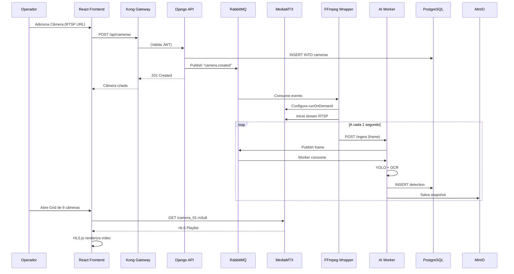

# Arquitetura de Componentes (Level 3 - C4 Model)

## Visão Geral

```
┌─────────────────────────────────────────────────────────────────┐
│                      GT-Vision Platform                          │
│  Suporte: 100 Câmeras RTSP │ Latência < 8s │ Uptime 98%         │
└─────────────────────────────────────────────────────────────────┘
         │                   │                    │
    ┌────▼────┐         ┌────▼────┐         ┌────▼────┐
    │ Edge    │         │ Core    │         │ Data    │
    │ Layer   │◄────────┤ Layer   │◄────────┤ Layer   │
    └─────────┘         └─────────┘         └─────────┘
         │                   │                    │
    [HAProxy]           [Django]            [Postgres]
    [Kong]              [FastAPI]           [Redis]
    [MediaMTX]          [Workers]           [RabbitMQ]
                                            [MinIO]
```

---

## 1. Container: Edge Layer (Streaming & Gateway)

**Responsabilidade:** Ingestão de RTSP, transcodificação HLS e proteção de rede.

### 1.1 HAProxy (Load Balancer + SSL Termination)

| Atributo | Valor |
|----------|-------|
| **Tecnologia** | HAProxy 2.8 (Alpine) |
| **Responsabilidade** | Terminação SSL/TLS 1.3, roteamento L7, rate limiting básico |
| **Portas** | 443 (HTTPS), 8404 (Stats) |
| **Recursos** | 2 CPU cores, 1 GB RAM |

**Configuração Crítica:**

```haproxy
global
    maxconn 10000
    ssl-default-bind-ciphers ECDHE-ECDSA-AES128-GCM-SHA256
    ssl-default-bind-options ssl-min-ver TLSv1.3

frontend https_in
    bind *:443 ssl crt /etc/ssl/certs/gt-vision.pem
    http-response set-header Strict-Transport-Security "max-age=31536000"
    http-response del-header Server  # Oculta versão do HAProxy
    
    # Rate Limiting Básico
    stick-table type ip size 100k expire 30s store http_req_rate(10s)
    http-request track-sc0 src
    http-request deny if { sc_http_req_rate(0) gt 100 }
    
    # Roteamento
    acl is_api path_beg /api
    acl is_stream path_beg /stream
    
    use_backend kong_backend if is_api
    use_backend mediamtx_backend if is_stream
```

**Health Check:**
```bash
curl -f http://localhost:8404/stats || exit 1
```

---

### 1.2 Kong Gateway (API Gateway)

| Atributo | Valor |
|----------|-------|
| **Tecnologia** | Kong 3.4 (DB-less mode) |
| **Responsabilidade** | Autenticação JWT, rate limiting avançado, logging estruturado |
| **Portas** | 8000 (HTTP), 8443 (HTTPS), 8001 (Admin API) |
| **Recursos** | 4 CPU cores, 2 GB RAM |

**Plugins Essenciais:**

```yaml
# kong.yml (Declarative Config)
_format_version: "3.0"

services:
  - name: django-api
    url: http://django:8000
    routes:
      - name: api-route
        paths:
          - /api
    plugins:
      - name: jwt
        config:
          claims_to_verify:
            - exp
          key_claim_name: kid
          secret_is_base64: false
      
      - name: rate-limiting
        config:
          minute: 100
          policy: redis
          redis_host: redis
          redis_port: 6379
      
      - name: correlation-id
        config:
          header_name: X-Correlation-ID
          echo_downstream: true
      
      - name: prometheus
        config:
          status_code_metrics: true
          latency_metrics: true
```

**Segurança:**
- **IP Whitelist (Opcional):** Admin API só acessível de IPs da prefeitura.
- **Request Size Limiting:** Max 10MB por request (evita ataques de memória).

---

### 1.3 MediaMTX (RTSP → HLS Transcoding)

| Atributo | Valor |
|----------|-------|
| **Tecnologia** | MediaMTX v1.3 (sucessor rtsp-simple-server) |
| **Responsabilidade** | Servidor RTSP/HLS, gerenciamento de streams, runOnDemand |
| **Portas** | 8554 (RTSP), 8888 (HLS), 8889 (WebRTC) |
| **Recursos** | 16 CPU cores, 32 GB RAM (para 100 streams) |

**Configuração Otimizada:**

```yaml
# mediamtx.yml
logLevel: info
readTimeout: 20s
writeTimeout: 20s

# HLS Low Latency
hlsVariant: lowLatency
hlsSegmentCount: 7
hlsSegmentDuration: 2s
hlsPartDuration: 500ms

# Paths Dinâmicos (runOnDemand)
paths:
  camera_~id~:
    runOnDemand: ffmpeg -rtsp_transport tcp -i ${RTSP_URL} -c:v copy -f hls -hls_time 2 -hls_list_size 5 -hls_flags delete_segments -hls_segment_filename /tmp/hls/camera_${id}_%03d.ts /tmp/hls/camera_${id}.m3u8
    runOnDemandRestart: yes
    runOnDemandCloseAfter: 30s  # Fecha se ninguém está assistindo
```

**Monitoramento:**
```bash
# Health Check
curl http://localhost:8889/metrics | grep mediamtx_paths_total
```

**Limitações Conhecidas:**
- **Máximo testado:** 150 streams simultâneos (com hardware de 32 cores).
- **Alternativa se falhar:** SRS (Simple Realtime Server) com clustering.

---

### 1.4 FFmpeg Wrapper (Stream Processor)

| Atributo | Valor |
|----------|-------|
| **Tecnologia** | Python 3.11 + subprocess (gerencia processos FFmpeg) |
| **Responsabilidade** | Transmuxa vídeo (copy), extrai frames (1 fps), envia para API de IA |
| **Processos** | 1 por câmera (100 processos paralelos) |
| **Recursos** | 100 MB RAM por processo |

**Script Principal:**

```python
# stream_processor.py
import subprocess
import requests
import logging
from circuitbreaker import circuit

logger = logging.getLogger(__name__)

class StreamProcessor:
    def __init__(self, camera_id: str, rtsp_url: str):
        self.camera_id = camera_id
        self.rtsp_url = rtsp_url
        self.process = None
    
    @circuit(failure_threshold=5, recovery_timeout=60)
    def start(self):
        """Inicia FFmpeg com Circuit Breaker"""
        cmd = [
            'ffmpeg',
            '-rtsp_transport', 'tcp',
            '-i', self.rtsp_url,
            '-c:v', 'copy',  # Não recodifica (CPU-friendly)
            '-f', 'hls',
            '-hls_time', '2',
            '-hls_list_size', '5',
            f'/tmp/hls/{self.camera_id}.m3u8',
            
            # Pipeline paralelo: Extrai frames
            '-vf', 'fps=1',  # 1 frame por segundo
            '-f', 'image2pipe',
            '-vcodec', 'mjpeg',
            'pipe:1'
        ]
        
        self.process = subprocess.Popen(
            cmd,
            stdout=subprocess.PIPE,
            stderr=subprocess.PIPE
        )
        
        # Lê frames e envia para IA
        for frame in self._read_frames():
            self._send_to_ai(frame)
    
    def _read_frames(self):
        """Lê frames do stdout do FFmpeg"""
        buffer = b''
        while True:
            chunk = self.process.stdout.read(1024)
            if not chunk:
                break
            buffer += chunk
            
            # Detecta delimitador JPEG (FFD8...FFD9)
            while True:
                start = buffer.find(b'\xff\xd8')
                end = buffer.find(b'\xff\xd9')
                if start != -1 and end != -1 and end > start:
                    frame = buffer[start:end+2]
                    buffer = buffer[end+2:]
                    yield frame
                else:
                    break
    
    def _send_to_ai(self, frame_bytes: bytes):
        """Envia frame para FastAPI de IA"""
        try:
            response = requests.post(
                'http://ai-service:8001/ingest',
                files={'frame': ('frame.jpg', frame_bytes, 'image/jpeg')},
                data={'camera_id': self.camera_id},
                timeout=2
            )
            if response.status_code != 200:
                logger.warning(f"AI service error: {response.text}")
        except requests.Timeout:
            logger.error(f"AI service timeout for camera {self.camera_id}")
```

**Circuit Breaker Behavior:**
- Se 5 tentativas de conexão falharem → Para de tentar por 60s.
- Após 60s → Tenta novamente (1 tentativa).
- Se sucesso → Reseta contador de falhas.

---

### 1.5 Watchdog (Process Monitor)

| Atributo | Valor |
|----------|-------|
| **Tecnologia** | Python 3.11 + APScheduler |
| **Responsabilidade** | Detecta FFmpeg travado e reinicia |
| **Intervalo** | Check a cada 15s |

**Lógica de Detecção:**

```python
# watchdog.py
import redis
import psutil
from datetime import datetime, timedelta

class Watchdog:
    def __init__(self):
        self.redis = redis.Redis(host='redis', port=6379)
    
    def check_health(self):
        """Verifica se cada stream está produzindo frames"""
        cameras = self.get_active_cameras()
        
        for camera in cameras:
            last_frame = self.redis.get(f"camera:{camera.id}:last_frame")
            
            if not last_frame:
                continue
            
            last_time = datetime.fromisoformat(last_frame.decode())
            elapsed = datetime.utcnow() - last_time
            
            if elapsed > timedelta(seconds=15):
                logger.error(f"Camera {camera.id} frozen! Restarting...")
                self.restart_stream(camera.id)
    
    def restart_stream(self, camera_id: str):
        """Mata processo FFmpeg e deixa MediaMTX recriá-lo"""
        for proc in psutil.process_iter(['pid', 'name', 'cmdline']):
            if 'ffmpeg' in proc.info['name']:
                if camera_id in ' '.join(proc.info['cmdline']):
                    proc.kill()
                    logger.info(f"Killed FFmpeg for camera {camera_id}")
```

**Métricas Expostas:**
```python
# Prometheus metrics
watchdog_restarts_total{camera_id="cam_01"} 3
watchdog_last_check_timestamp 1703001234
```

---

## 2. Container: Core Layer (Business Logic)

### 2.1 Django API (Monolith)

| Atributo | Valor |
|----------|-------|
| **Tecnologia** | Django 4.2 + Django REST Framework 3.14 |
| **Responsabilidade** | Autenticação, CRUD de câmeras, orquestração de jobs |
| **Portas** | 8000 (HTTP) |
| **Recursos** | 8 CPU cores, 16 GB RAM |
| **Workers** | Gunicorn com 16 workers (2 × CPU cores) |

**Estrutura de Pastas (Clean Architecture):**

```
django_app/
├── core/
│   ├── domain/
│   │   ├── entities.py          # Camera, Detection, User
│   │   ├── value_objects.py     # RTSPURL, PlateNumber
│   │   └── repositories.py      # ICameraRepository (interface)
│   ├── usecases/
│   │   ├── auth_usecase.py      # Login, JWT generation
│   │   ├── camera_usecase.py    # CreateCamera, UpdateCamera
│   │   └── search_usecase.py    # SearchByPlate
│   └── interfaces/
│       ├── api/
│       │   ├── views.py         # REST endpoints
│       │   ├── serializers.py   # DRF serializers
│       │   └── permissions.py   # Role-based access
│       └── signals.py           # Post-save hooks
├── infrastructure/
│   ├── persistence/
│   │   ├── models.py            # Django ORM models
│   │   ├── repositories_impl.py # Concrete implementations
│   │   └── migrations/
│   ├── messaging/
│   │   ├── rabbitmq_client.py   # Publish to queues
│   │   └── events.py            # Event schemas
│   ├── storage/
│   │   └── minio_client.py      # S3-compatible storage
│   └── security/
│       ├── jwt_handler.py       # RS256 signing
│       └── encryption.py        # Fernet for RTSP URLs
└── settings/
    ├── base.py
    ├── production.py
    └── test.py
```

**Componentes Críticos:**

#### 2.1.1 AuthUseCase (Autenticação)

```python
# core/usecases/auth_usecase.py
from cryptography.hazmat.primitives import serialization
from cryptography.hazmat.backends import default_backend
import jwt
from datetime import datetime, timedelta

class AuthUseCase:
    def __init__(self, user_repository):
        self.user_repo = user_repository
        with open('/secrets/jwt-private.pem', 'rb') as f:
            self.private_key = serialization.load_pem_private_key(
                f.read(),
                password=None,
                backend=default_backend()
            )
    
    def login(self, username: str, password: str) -> dict:
        user = self.user_repo.find_by_username(username)
        if not user or not user.check_password(password):
            raise AuthenticationError("Invalid credentials")
        
        access_token = self._generate_token(user, expires_in=15*60)  # 15min
        refresh_token = self._generate_token(user, expires_in=24*3600)  # 24h
        
        return {
            'access_token': access_token,
            'refresh_token': refresh_token,
            'user': {'id': user.id, 'role': user.role}
        }
    
    def _generate_token(self, user, expires_in: int) -> str:
        payload = {
            'sub': str(user.id),
            'role': user.role,
            'exp': datetime.utcnow() + timedelta(seconds=expires_in),
            'iat': datetime.utcnow(),
            'kid': 'key-2024'  # Key ID para rotação
        }
        return jwt.encode(payload, self.private_key, algorithm='RS256')
```

#### 2.1.2 CameraUseCase (Gestão de Câmeras)

```python
# core/usecases/camera_usecase.py
from core.domain.entities import Camera
from infrastructure.messaging.rabbitmq_client import publish_event

class CameraUseCase:
    def __init__(self, camera_repo, rabbitmq_client):
        self.camera_repo = camera_repo
        self.rabbitmq = rabbitmq_client
    
    def create_camera(self, name: str, rtsp_url: str, location: str) -> Camera:
        # Valida RTSP URL
        if not self._test_rtsp_connection(rtsp_url):
            raise ValidationError("Cannot connect to RTSP stream")
        
        # Criptografa URL antes de salvar
        encrypted_url = encrypt_rtsp_url(rtsp_url)
        
        camera = Camera(
            name=name,
            rtsp_url=encrypted_url,
            location=location,
            status='provisioning'
        )
        
        # Salva no banco
        camera = self.camera_repo.save(camera)
        
        # Dispara provisionamento assíncrono
        self.rabbitmq.publish(
            exchange='camera_events',
            routing_key='camera.created',
            message={
                'camera_id': str(camera.id),
                'rtsp_url': rtsp_url,  # Descriptografada para o worker
                'action': 'start_stream'
            }
        )
        
        return camera
    
    def _test_rtsp_connection(self, rtsp_url: str) -> bool:
        """Testa conexão RTSP com timeout de 5s"""
        import subprocess
        try:
            result = subprocess.run(
                ['ffprobe', '-rtsp_transport', 'tcp', '-i', rtsp_url],
                timeout=5,
                capture_output=True
            )
            return result.returncode == 0
        except subprocess.TimeoutExpired:
            return False
```

#### 2.1.3 Signal Handler (Post-Save Hook)

```python
# infrastructure/interfaces/signals.py
from django.db.models.signals import post_save
from django.dispatch import receiver
from infrastructure.persistence.models import CameraModel
from infrastructure.messaging.rabbitmq_client import RabbitMQClient

@receiver(post_save, sender=CameraModel)
def on_camera_saved(sender, instance, created, **kwargs):
    """
    Dispara evento de provisionamento quando câmera é salva.
    Usa debounce para evitar múltiplas mensagens em race conditions.
    """
    if created or instance.tracker.has_changed('rtsp_url'):
        rabbitmq = RabbitMQClient()
        rabbitmq.publish(
            exchange='camera_events',
            routing_key='camera.updated',
            message={
                'camera_id': str(instance.id),
                'rtsp_url': instance.decrypt_rtsp_url(),
                'action': 'reconfigure_stream'
            },
            headers={'idempotency_key': f"{instance.id}_{instance.updated_at}"}
        )
```

**Segurança (settings/production.py):**

```python
# Django Security Headers
SECURE_SSL_REDIRECT = True
SECURE_HSTS_SECONDS = 31536000
SECURE_HSTS_INCLUDE_SUBDOMAINS = True
SECURE_CONTENT_TYPE_NOSNIFF = True
SECURE_BROWSER_XSS_FILTER = True
X_FRAME_OPTIONS = 'DENY'
CSRF_COOKIE_SECURE = True
SESSION_COOKIE_SECURE = True

# Password Validation
AUTH_PASSWORD_VALIDATORS = [
    {'NAME': 'django.contrib.auth.password_validation.MinimumLengthValidator',
     'OPTIONS': {'min_length': 12}},
    {'NAME': 'django.contrib.auth.password_validation.CommonPasswordValidator'},
    {'NAME': 'django.contrib.auth.password_validation.NumericPasswordValidator'},
]

# Database Pooling (PgBouncer)
DATABASES = {
    'default': {
        'ENGINE': 'django.db.backends.postgresql',
        'HOST': 'pgbouncer',
        'PORT': 6432,
        'OPTIONS': {
            'connect_timeout': 10,
            'options': '-c statement_timeout=30000'  # 30s
        }
    }
}
```

---

### 2.2 FastAPI AI Service (Ingestão de Frames)

| Atributo | Valor |
|----------|-------|
| **Tecnologia** | FastAPI 0.104 + Pydantic v2 |
| **Responsabilidade** | Receber frames, validar, publicar na fila RabbitMQ |
| **Portas** | 8001 (HTTP) |
| **Recursos** | 4 CPU cores, 8 GB RAM |

**Endpoints:**

```python
# ai_service/main.py
from fastapi import FastAPI, File, UploadFile, Form, HTTPException
from pydantic import BaseModel
import aio_pika
import logging

app = FastAPI()
logger = logging.getLogger(__name__)

class FrameMetadata(BaseModel):
    camera_id: str
    timestamp: str

@app.post("/ingest")
async def ingest_frame(
    camera_id: str = Form(...),
    frame: UploadFile = File(...)
):
    """
    Recebe frame do FFmpeg e publica na fila de processamento.
    
    Rate Limit: 100 frames/s por câmera (controlado no Kong).
    """
    # Valida tipo MIME
    if frame.content_type not in ['image/jpeg', 'image/png']:
        raise HTTPException(400, "Invalid image format")
    
    # Valida tamanho (max 5 MB)
    content = await frame.read()
    if len(content) > 5 * 1024 * 1024:
        raise HTTPException(413, "Frame too large")
    
    # Publica na fila RabbitMQ
    connection = await aio_pika.connect_robust("amqp://rabbitmq")
    channel = await connection.channel()
    
    await channel.default_exchange.publish(
        aio_pika.Message(
            body=content,
            headers={
                'camera_id': camera_id,
                'timestamp': datetime.utcnow().isoformat()
            }
        ),
        routing_key='vision_events'
    )
    
    await connection.close()
    
    return {"status": "queued", "camera_id": camera_id}

@app.get("/health")
async def health_check():
    """Health check para Docker/K8s"""
    return {"status": "healthy"}
```

**Rate Limiting (Kong):**
```yaml
plugins:
  - name: rate-limiting
    config:
      second: 100  # Max 100 frames/s por câmera
      policy: redis
      fault_tolerant: true
```

---

### 2.3 AI Workers (Processamento de Frames)

| Atributo | Valor |
|----------|-------|
| **Tecnologia** | Python 3.11 + YOLO v8 + EasyOCR |
| **Responsabilidade** | Detecção de veículos e OCR de placas |
| **Escalabilidade** | Horizontal (múltiplos workers) |
| **Recursos** | 1 worker = 4 GB RAM + 1/4 GPU |

**Worker Principal:**

```python
# ai_worker/detector.py
import pika
import torch
from ultralytics import YOLO
import easyocr
import cv2
import numpy as np
from minio import Minio
import logging

logger = logging.getLogger(__name__)

class VehicleDetector:
    def __init__(self):
        # Carrega modelo YOLO
        self.model = YOLO('yolov8n.pt')  # Nano = mais rápido
        self.model.to('cuda' if torch.cuda.is_available() else 'cpu')
        
        # OCR para placas brasileiras
        self.ocr_reader = easyocr.Reader(['pt'], gpu=True)
        
        # MinIO para storage
        self.minio_client = Minio(
            'minio:9000',
            access_key='minioadmin',
            secret_key='minioadmin',
            secure=False
        )
    
    def process_frame(self, frame_bytes: bytes, camera_id: str):
        """Detecta veículos e extrai placas"""
        # Decodifica imagem
        nparr = np.frombuffer(frame_bytes, np.uint8)
        image = cv2.imdecode(nparr, cv2.IMREAD_COLOR)
        
        # Detecta objetos
        results = self.model(image, conf=0.5, classes=[2, 3, 5, 7])  # car, motorcycle, bus, truck
        
        detections = []
        for result in results:
            for box in result.boxes:
                # Recorta região do veículo
                x1, y1, x2, y2 = map(int, box.xyxy[0])
                vehicle_crop = image[y1:y2, x1:x2]
                
                # Tenta ler placa
                plate_text = self._extract_plate(vehicle_crop)
                
                # Salva snapshot no MinIO
                snapshot_path = self._save_snapshot(vehicle_crop, camera_id)
                
                detections.append({
                    'type': 'vehicle',
                    'confidence': float(box.conf),
                    'plate': plate_text,
                    'snapshot_path': snapshot_path
                })
        
        return detections
    
    def _extract_plate(self, vehicle_image) -> str:
        """OCR de placa brasileira (Mercosul/Cinza)"""
        # Preprocessamento
        gray = cv2.cvtColor(vehicle_image, cv2.COLOR_BGR2GRAY)
        _, binary = cv2.threshold(gray, 0, 255, cv2.THRESH_BINARY + cv2.THRESH_OTSU)
        
        # OCR
        results = self.ocr_reader.readtext(binary)
        
        for (bbox, text, confidence) in results:
            # Valida formato brasileiro: ABC1D23 ou ABC-1234
            if self._is_valid_plate(text) and confidence > 0.7:
                return text.upper().replace(' ', '')
        
        return None
    
    def _is_valid_plate(self, text: str) -> bool:
        """Valida formato de placa brasileira"""
        import re
        patterns = [
            r'^[A-Z]{3}\d[A-Z]\d{2}$',  # Mercosul: ABC1D23
            r'^[A-Z]{3}-?\d{4}$'        # Antiga: ABC-1234
        ]
        return any(re.match(p, text.upper().replace(' ', '')) for p in patterns)
    
    def _save_snapshot(self, image, camera_id: str) -> str:
        """Salva frame no MinIO"""
        timestamp = datetime.utcnow().isoformat()
        path = f"{camera_id}/{timestamp}.jpg"
        
        _, buffer = cv2.imencode('.jpg', image, [cv2.IMWRITE_JPEG_QUALITY, 80])
        
        self.minio_client.put_object(
            'detections',
            path,
            io.BytesIO(buffer),
            len(buffer),
            content_type='image/jpeg'
        )
        
        return f"s3://detections/{path}"

# Consumer Loop
def main():
    connection = pika.BlockingConnection(pika.ConnectionParameters('rabbitmq'))
    channel = connection.channel()
    channel.queue_declare(queue='vision_events', durable=True)
    
    detector = VehicleDetector()
    
    def callback(ch, method, properties, body):
        try:
            camera_id = properties.headers['camera_id']
            detections = detector.process_frame(body, camera_id)
            
            # Salva no banco via Django API
            for det in detections:
                requests.post('http://django:8000/api/detections/', json={
                    'camera_id': camera_id,
                    'type': det['type'],
                    'confidence': det['confidence'],
                    'plate_text': det['plate'],
                    'snapshot_path': det['snapshot_path']
                })
            
            ch.basic_ack(delivery_tag=method.delivery_tag)
        except Exception as e:
            logger.error(f"Processing error: {e}")
            ch.basic_nack(delivery_tag=method.delivery_tag, requeue=True)
    
    channel.basic_qos(prefetch_count=1)
    channel.basic_consume(queue='vision_events', on_message_callback=callback)
    
    logger.info("AI Worker started. Waiting for frames...")
    channel.start_consuming()

if __name__ == '__main__':
    main()
```

**Fallback Mode (CPU):**

```python
# Se GPU não disponível, usa modelo Lite
if not torch.cuda.is_available():
    logger.warning("GPU not available. Using CPU mode (slower)")
    self.model = YOLO('yolov8n.pt')  # Nano = 2x mais rápido que S
    self.ocr_reader = easyocr.Reader(['pt'], gpu=False)
```

---

## 3. Container: Data Layer (Persistence)

### 3.1 PostgreSQL + PgBouncer

**Configuração:**

```ini
# pgbouncer.ini
[databases]
gt_vision = host=postgres port=5432 dbname=gt_vision

[pgbouncer]
listen_addr = *
listen_port = 6432
auth_type = md5
auth_file = /etc/pgbouncer/userlist.txt
pool_mode = session  # NÃO transaction (Django incompatível)
max_client_conn = 200
default_pool_size = 25
reserve_pool_size = 5
reserve_pool_timeout = 3
```

```sql
-- Índices Críticos
CREATE INDEX idx_detections_plate_gin ON detections 
USING gin (to_tsvector('portuguese', plate_text));

CREATE INDEX idx_detections_camera_timestamp ON detections (camera_id, timestamp DESC);

CREATE INDEX idx_cameras_status ON cameras (status) WHERE status = 'offline';
```

### 3.2 Redis (Cache + Broker)

**Uso:**
- **Cache:** Status de câmeras (TTL 10s)
- **Session Store:** Django sessions
- **Rate Limiting:** Kong rate limit counters
- **Pub/Sub:** Notificações real-time (WebSocket)

```python
# Exemplo de cache
redis.setex(f"camera:{camera_id}:status", 10, "online")
```

### 3.3 RabbitMQ (Message Broker)

**Exchanges e Queues:**

```
camera_events (topic) ──┬──> camera.created ──> provisioning_queue
                        └──> camera.updated ──> reconfiguration_queue

vision_events (direct) ────> vision_events ──> ai_worker_queue
```

### 3.4 MinIO (Object Storage)

**Buckets:**
- `detections`: Snapshots de veículos (retenção: 30 dias)
- `backups`: Backups do banco

**Lifecycle Policy:**

```json
{
  "Rules": [
    {
      "ID": "delete-old-detections",
      "Status": "Enabled",
      "Expiration": {
        "Days": 30
      },
      "Filter": {
        "Prefix": "detections/"
      }
    }
  ]
}
```

---

## 4. Observabilidade Stack

### 4.1 Prometheus + Grafana

**Métricas Coletadas:**

```yaml
# Prometheus scrape config
scrape_configs:
  - job_name: 'django'
    static_configs:
      - targets: ['django:8000']
    metrics_path: '/metrics'
  
  - job_name: 'mediamtx'
    static_configs:
      - targets: ['mediamtx:8889']
  
  - job_name: 'kong'
    static_configs:
      - targets: ['kong:8001']
    metrics_path: '/metrics'
```

**Dashboards Grafana:**
- **Uptime por Câmera:** % de disponibilidade últimas 24h
- **Latência de Streaming:** P50, P95, P99
- **Fila de IA:** Tamanho da fila + processing time
- **Taxa de Detecção:** Veículos/hora por câmera

### 4.2 Loki (Logs Centralizados)

```yaml
# promtail.yml
clients:
  - url: http://loki:3100/loki/api/v1/push

scrape_configs:
  - job_name: containers
    static_configs:
      - labels:
          __path__: /var/lib/docker/containers/*/*.log
```

---

## 5. Diagrama de Fluxo (Sequência Crítica)



---

**Versão:** 2.0  
**Última Atualização:** 19/Dez/2024  
**Próxima Revisão:** Sprint 2