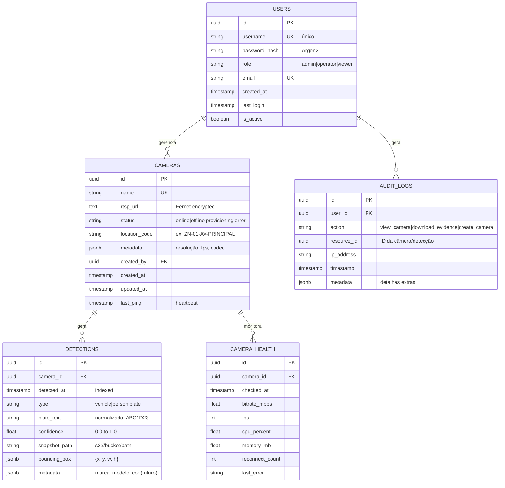

# Modelagem de Dados - GT-Vision MVP

## 1. Diagrama Entidade-Relacionamento



---

## 2. Schema SQL (PostgreSQL 15+)

### 2.1 Tabela: users

```sql
CREATE TABLE users (
    id UUID PRIMARY KEY DEFAULT gen_random_uuid(),
    username VARCHAR(50) NOT NULL UNIQUE,
    password_hash VARCHAR(255) NOT NULL,  -- Argon2id
    role VARCHAR(20) NOT NULL CHECK (role IN ('admin', 'operator', 'viewer')),
    email VARCHAR(255) UNIQUE,
    created_at TIMESTAMPTZ DEFAULT NOW(),
    last_login TIMESTAMPTZ,
    is_active BOOLEAN DEFAULT TRUE
);

-- Índices
CREATE INDEX idx_users_role ON users (role);
CREATE INDEX idx_users_active ON users (is_active) WHERE is_active = TRUE;
```

---

### 2.2 Tabela: cameras

```sql
CREATE TABLE cameras (
    id UUID PRIMARY KEY DEFAULT gen_random_uuid(),
    name VARCHAR(100) NOT NULL UNIQUE,
    rtsp_url TEXT NOT NULL,  -- Criptografado com Fernet
    status VARCHAR(20) NOT NULL DEFAULT 'provisioning' 
        CHECK (status IN ('online', 'offline', 'provisioning', 'error')),
    location_code VARCHAR(50) NOT NULL,
    metadata JSONB DEFAULT '{}',  -- {resolution: "1080p", fps: 25, codec: "h264"}
    created_by UUID REFERENCES users(id),
    created_at TIMESTAMPTZ DEFAULT NOW(),
    updated_at TIMESTAMPTZ DEFAULT NOW(),
    last_ping TIMESTAMPTZ  -- Atualizado a cada 10s pelo Watchdog
);

-- Índices
CREATE INDEX idx_cameras_status ON cameras (status);
CREATE INDEX idx_cameras_location ON cameras (location_code);
CREATE INDEX idx_cameras_last_ping ON cameras (last_ping DESC);

-- Índice Parcial: Apenas câmeras offline (otimiza dashboard)
CREATE INDEX idx_cameras_offline ON cameras (id, name) 
WHERE status = 'offline';

-- Trigger: Atualiza updated_at
CREATE OR REPLACE FUNCTION update_updated_at_column()
RETURNS TRIGGER AS $$
BEGIN
    NEW.updated_at = NOW();
    RETURN NEW;
END;
$$ LANGUAGE plpgsql;

CREATE TRIGGER cameras_updated_at
BEFORE UPDATE ON cameras
FOR EACH ROW
EXECUTE FUNCTION update_updated_at_column();
```

**Segurança:**
- **Criptografia de RTSP URL:** Feita no nível da aplicação (Django) usando `django-cryptography`:

```python
from django_cryptography.fields import encrypt

class Camera(models.Model):
    rtsp_url = encrypt(models.TextField())
```

- **Key Management:** Chave Fernet armazenada em `/secrets/fernet.key` (montada via Docker secret).

---

### 2.3 Tabela: detections (Particionada por Mês)

**Problema:** 100 câmeras × 1 frame/seg × 86400 seg/dia = **8.6M detecções/dia**.  
Em 30 dias = **258M registros** → Query lenta sem particionamento.

**Solução:** Particionamento nativo do PostgreSQL por range de data.

```sql
-- Tabela Pai
CREATE TABLE detections (
    id UUID DEFAULT gen_random_uuid(),
    camera_id UUID NOT NULL REFERENCES cameras(id) ON DELETE CASCADE,
    detected_at TIMESTAMPTZ NOT NULL,
    type VARCHAR(20) NOT NULL CHECK (type IN ('vehicle', 'person', 'plate')),
    plate_text VARCHAR(10),  -- Normalizado: ABC1D23 (sem hífen)
    confidence FLOAT CHECK (confidence BETWEEN 0.0 AND 1.0),
    snapshot_path TEXT NOT NULL,  -- s3://detections/camera_id/YYYY/MM/DD/timestamp.jpg
    bounding_box JSONB,  -- {x: 100, y: 200, w: 300, h: 150}
    metadata JSONB DEFAULT '{}'  -- Futuro: marca, modelo, cor
) PARTITION BY RANGE (detected_at);

-- Partições (criar para cada mês)
CREATE TABLE detections_2025_01 PARTITION OF detections
FOR VALUES FROM ('2025-01-01') TO ('2025-02-01');

CREATE TABLE detections_2025_02 PARTITION OF detections
FOR VALUES FROM ('2025-02-01') TO ('2025-03-01');

-- Script automático para criar partições futuras (rodar mensalmente)
CREATE OR REPLACE FUNCTION create_next_partition()
RETURNS VOID AS $$
DECLARE
    partition_name TEXT;
    start_date DATE;
    end_date DATE;
BEGIN
    start_date := DATE_TRUNC('month', CURRENT_DATE + INTERVAL '1 month');
    end_date := start_date + INTERVAL '1 month';
    partition_name := 'detections_' || TO_CHAR(start_date, 'YYYY_MM');
    
    EXECUTE FORMAT(
        'CREATE TABLE IF NOT EXISTS %I PARTITION OF detections
         FOR VALUES FROM (%L) TO (%L)',
        partition_name, start_date, end_date
    );
END;
$$ LANGUAGE plpgsql;

-- Agendar via pg_cron (extensão)
SELECT cron.schedule('create-partition', '0 0 1 * *', 'SELECT create_next_partition()');
```

**Índices nas Partições:**

```sql
-- Índice para busca por placa (GIN para full-text search)
CREATE INDEX idx_detections_plate_gin ON detections 
USING gin (to_tsvector('simple', COALESCE(plate_text, '')));

-- Índice composto: câmera + timestamp (query mais comum)
CREATE INDEX idx_detections_camera_time ON detections (camera_id, detected_at DESC);

-- Índice para filtragem por tipo
CREATE INDEX idx_detections_type ON detections (type);

-- Índice parcial: Apenas detecções com placa (economiza espaço)
CREATE INDEX idx_detections_with_plate ON detections (plate_text, detected_at DESC)
WHERE plate_text IS NOT NULL;
```

**Queries Otimizadas:**

```sql
-- Busca por placa (usa GIN index)
SELECT id, camera_id, detected_at, snapshot_path
FROM detections
WHERE to_tsvector('simple', plate_text) @@ to_tsquery('simple', 'ABC1D23')
  AND detected_at > NOW() - INTERVAL '7 days'
ORDER BY detected_at DESC
LIMIT 50;

-- Timeline de um veículo específico
SELECT 
    d.detected_at,
    c.name AS camera_name,
    c.location_code,
    d.snapshot_path
FROM detections d
JOIN cameras c ON d.camera_id = c.id
WHERE d.plate_text = 'ABC1D23'
  AND d.detected_at BETWEEN '2025-01-01' AND '2025-01-31'
ORDER BY d.detected_at ASC;

-- Análise: Top 10 placas mais detectadas (últimos 7 dias)
SELECT 
    plate_text,
    COUNT(*) AS detections_count,
    MIN(detected_at) AS first_seen,
    MAX(detected_at) AS last_seen,
    ARRAY_AGG(DISTINCT camera_id) AS cameras
FROM detections
WHERE detected_at > NOW() - INTERVAL '7 days'
  AND plate_text IS NOT NULL
GROUP BY plate_text
ORDER BY detections_count DESC
LIMIT 10;
```

---

### 2.4 Tabela: camera_health (Time-Series)

```sql
CREATE TABLE camera_health (
    id UUID PRIMARY KEY DEFAULT gen_random_uuid(),
    camera_id UUID NOT NULL REFERENCES cameras(id) ON DELETE CASCADE,
    checked_at TIMESTAMPTZ NOT NULL DEFAULT NOW(),
    bitrate_mbps FLOAT,
    fps INT,
    cpu_percent FLOAT,
    memory_mb FLOAT,
    reconnect_count INT DEFAULT 0,
    last_error TEXT
);

-- Hypertable do TimescaleDB (se usar extensão)
SELECT create_hypertable('camera_health', 'checked_at', chunk_time_interval => INTERVAL '1 day');

-- Índice
CREATE INDEX idx_camera_health_camera_time ON camera_health (camera_id, checked_at DESC);

-- Retenção automática (30 dias)
SELECT add_retention_policy('camera_health', INTERVAL '30 days');
```

**Query para Dashboard:**

```sql
-- Média de uptime por câmera (últimas 24h)
SELECT 
    c.name,
    c.location_code,
    COUNT(*) FILTER (WHERE h.bitrate_mbps > 0) * 100.0 / COUNT(*) AS uptime_percent,
    AVG(h.bitrate_mbps) AS avg_bitrate,
    MAX(h.reconnect_count) AS max_reconnects
FROM cameras c
LEFT JOIN camera_health h ON c.id = h.camera_id 
    AND h.checked_at > NOW() - INTERVAL '24 hours'
GROUP BY c.id, c.name, c.location_code
ORDER BY uptime_percent ASC;
```

---

### 2.5 Tabela: audit_logs (LGPD Compliance)

```sql
CREATE TABLE audit_logs (
    id UUID PRIMARY KEY DEFAULT gen_random_uuid(),
    user_id UUID REFERENCES users(id),
    action VARCHAR(50) NOT NULL,  -- view_camera, download_evidence, create_camera
    resource_type VARCHAR(50),  -- camera, detection, user
    resource_id UUID,
    ip_address INET,
    user_agent TEXT,
    timestamp TIMESTAMPTZ DEFAULT NOW(),
    metadata JSONB DEFAULT '{}'
) PARTITION BY RANGE (timestamp);

-- Partições mensais (mesmo padrão de detections)
CREATE TABLE audit_logs_2025_01 PARTITION OF audit_logs
FOR VALUES FROM ('2025-01-01') TO ('2025-02-01');

-- Índices
CREATE INDEX idx_audit_user_time ON audit_logs (user_id, timestamp DESC);
CREATE INDEX idx_audit_action ON audit_logs (action);
CREATE INDEX idx_audit_resource ON audit_logs (resource_type, resource_id);

-- Retenção: 6 meses (Marco Civil Art. 11)
CREATE OR REPLACE FUNCTION delete_old_audit_logs()
RETURNS VOID AS $$
BEGIN
    DELETE FROM audit_logs WHERE timestamp < NOW() - INTERVAL '6 months';
END;
$$ LANGUAGE plpgsql;

-- Agendar via pg_cron
SELECT cron.schedule('cleanup-audit', '0 2 * * 0', 'SELECT delete_old_audit_logs()');
```

**Trigger Automático:**

```python
# Django Signal (middleware)
from django.db.models.signals import post_save
from django.dispatch import receiver

@receiver(post_save, sender=Detection)
def log_detection_view(sender, instance, **kwargs):
    AuditLog.objects.create(
        user_id=request.user.id,
        action='view_detection',
        resource_type='detection',
        resource_id=instance.id,
        ip_address=get_client_ip(request),
        metadata={'camera_id': str(instance.camera_id)}
    )
```

---

## 3. Estratégia de Storage (MinIO)

### 3.1 Estrutura de Diretórios

```
s3://gt-vision-detections/
├── camera_01/
│   ├── 2025/
│   │   ├── 01/
│   │   │   ├── 15/
│   │   │   │   ├── 2025-01-15T10:30:45.123Z.jpg
│   │   │   │   ├── 2025-01-15T10:30:46.456Z.jpg
│   │   │   │   └── ...
│   │   │   └── 16/
│   │   └── 02/
│   └── ...
├── camera_02/
└── ...
```

**Benefícios:**
- Particionamento natural por data facilita limpeza (delete por prefixo).
- Queries S3 Select otimizadas por path.

### 3.2 Lifecycle Policy

```json
{
  "Rules": [
    {
      "ID": "expire-old-detections",
      "Status": "Enabled",
      "Expiration": {
        "Days": 30
      },
      "Filter": {
        "Prefix": ""
      }
    },
    {
      "ID": "transition-to-glacier",
      "Status": "Enabled",
      "Transitions": [
        {
          "Days": 7,
          "StorageClass": "GLACIER"
        }
      ],
      "Filter": {
        "Prefix": ""
      }
    }
  ]
}
```

**Conformidade LGPD:**
- Após 30 dias, objetos são deletados automaticamente.
- Relatório de compliance gerado mensalmente:

```sql
-- Quantos snapshots existem além do prazo?
SELECT COUNT(*) 
FROM detections 
WHERE detected_at < NOW() - INTERVAL '31 days';
```

---

## 4. Dimensionamento de Storage

### 4.1 Cálculo de Espaço (Detections)

```
Premissas:
- 100 câmeras
- 1 frame/segundo por câmera
- Tamanho médio do snapshot: 500 KB (JPEG 80% quality)
- Retenção: 30 dias

Cálculo:
100 câmeras × 1 frame/s × 86400 s/dia × 30 dias × 500 KB = 129.6 TB

Com Compressão (80% quality):
129.6 TB × 0.7 (ratio) = 90.7 TB

Com LGPD (7 dias retenção):
90.7 TB × (7/30) = 21.2 TB
```

**Recomendação:** 30 TB de storage (margem de segurança).

### 4.2 Cálculo de IOPS

```
Operações de Write:
100 câmeras × 1 write/s = 100 IOPS

Operações de Read (pico):
20 operadores × 5 câmeras × 1 read/2s = 50 IOPS

Total: 150 IOPS (SSD é suficiente, >10k IOPS)
```

---

## 5. Backup e Disaster Recovery

### 5.1 Estratégia de Backup

```yaml
Postgres:
  Frequência: Diário (2h da manhã)
  Retenção: 30 dias
  Ferramenta: pg_dump com compressão gzip
  Destino: S3 bucket separado (gt-vision-backups)

MinIO:
  Frequência: Semanal (domingo 3h)
  Retenção: 4 semanas
  Ferramenta: mc mirror (MinIO Client)
  Destino: Storage externo (on-premises ou outro cloud)
```

### 5.2 Procedure de Restore

```bash
# Restore do Banco (RTO < 1 hora)
# 1. Baixar backup mais recente
aws s3 cp s3://gt-vision-backups/postgres/2025-01-15.dump.gz /tmp/

# 2. Restaurar
gunzip /tmp/2025-01-15.dump.gz
psql -U postgres -d gt_vision < /tmp/2025-01-15.dump

# 3. Verificar integridade
psql -U postgres -d gt_vision -c "SELECT COUNT(*) FROM cameras;"
```

**RPO (Recovery Point Objective):** 24 horas (backup diário).  
**RTO (Recovery Time Objective):** 1 hora (tempo de restore).

---

## 6. Migrations (Django)

### 6.1 Estrutura Inicial

```python
# 0001_initial.py
from django.db import migrations, models
import uuid

class Migration(migrations.Migration):
    initial = True
    
    operations = [
        migrations.CreateModel(
            name='User',
            fields=[
                ('id', models.UUIDField(primary_key=True, default=uuid.uuid4)),
                ('username', models.CharField(max_length=50, unique=True)),
                ('password_hash', models.CharField(max_length=255)),
                ('role', models.CharField(max_length=20, choices=[
                    ('admin', 'Admin'),
                    ('operator', 'Operator'),
                    ('viewer', 'Viewer')
                ])),
                ('created_at', models.DateTimeField(auto_now_add=True)),
            ],
        ),
        
        migrations.CreateModel(
            name='Camera',
            fields=[
                ('id', models.UUIDField(primary_key=True, default=uuid.uuid4)),
                ('name', models.CharField(max_length=100, unique=True)),
                ('rtsp_url', encrypt(models.TextField())),
                ('status', models.CharField(max_length=20, default='provisioning')),
                ('location_code', models.CharField(max_length=50)),
                ('metadata', models.JSONField(default=dict)),
                ('created_by', models.ForeignKey('User', on_delete=models.SET_NULL, null=True)),
            ],
        ),
        
        migrations.RunSQL(
            # Criar partições iniciais
            """
            CREATE TABLE detections_2025_01 PARTITION OF detections
            FOR VALUES FROM ('2025-01-01') TO ('2025-02-01');
            """
        ),
    ]
```

---

## 7. Monitoring Queries (Grafana)

```sql
-- Dashboard 1: Câmeras Offline (alerta se > 10%)
SELECT 
    COUNT(*) FILTER (WHERE status = 'offline') * 100.0 / COUNT(*) AS offline_percent
FROM cameras;

-- Dashboard 2: Taxa de Detecção (veículos/hora)
SELECT 
    DATE_TRUNC('hour', detected_at) AS hour,
    COUNT(*) AS detections_count
FROM detections
WHERE detected_at > NOW() - INTERVAL '24 hours'
  AND type = 'vehicle'
GROUP BY hour
ORDER BY hour DESC;

-- Dashboard 3: Top 5 Câmeras com Mais Erros
SELECT 
    c.name,
    COUNT(h.last_error) AS error_count,
    MAX(h.last_error) AS last_error_message
FROM cameras c
JOIN camera_health h ON c.id = h.camera_id
WHERE h.last_error IS NOT NULL
  AND h.checked_at > NOW() - INTERVAL '24 hours'
GROUP BY c.id, c.name
ORDER BY error_count DESC
LIMIT 5;
```

---

## 8. Performance Tuning

### 8.1 PostgreSQL Config

```ini
# postgresql.conf (para 16 GB RAM)
shared_buffers = 4GB
effective_cache_size = 12GB
maintenance_work_mem = 1GB
checkpoint_completion_target = 0.9
wal_buffers = 16MB
default_statistics_target = 100
random_page_cost = 1.1  # SSD
effective_io_concurrency = 200
work_mem = 16MB
min_wal_size = 1GB
max_wal_size = 4GB
max_worker_processes = 8
max_parallel_workers_per_gather = 4
max_parallel_workers = 8
```

### 8.2 Vacuum Strategy

```sql
-- Configurar autovacuum agressivo para detections (alta inserção)
ALTER TABLE detections SET (
    autovacuum_vacuum_scale_factor = 0.01,
    autovacuum_analyze_scale_factor = 0.005
);
```

---

**Versão:** 2.0  
**Autor:** Time GT-Vision  
**Última Revisão:** 19/Dez/2024